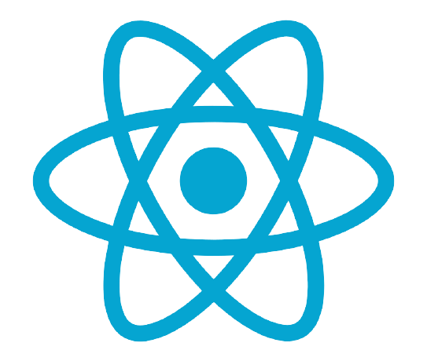
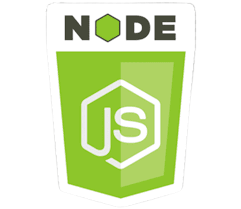
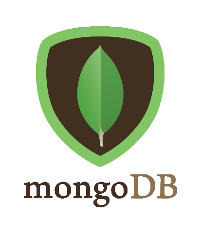

<h2 align="center">Hi there, my name is Reno 👋🏼</h2>

✍🏼 I currently work as a Junior Frontend Mentor at Codecool. These courses help people to change their carreer and start a new chapter in IT. In fact, I studied full stack development in Codecool. It was a year long course and I had the chance to get familiar with a number of technologies, both backend and frontend, however it's clear now that I want to dig deeper in **frontend** development. It's really fascinating to see an app **visually unfold** and be a part of it. Thanks to the frontend course I learned about the MERN stack, which was love at first sight. During my studies, I had the chance to improve my **soft skills** as well, such as **agile** methodologies, team work, communcation, growth mindset, time management and presentation.

💚 Interests/Technologies: ReactJs, NodeJS, ExpressJS, MongoDB, HTML, CSS, JS, Bootstrap

  
  
  
  

🔥 Fun fact about me, I am really passionate about dance, especially hip hop.

  

