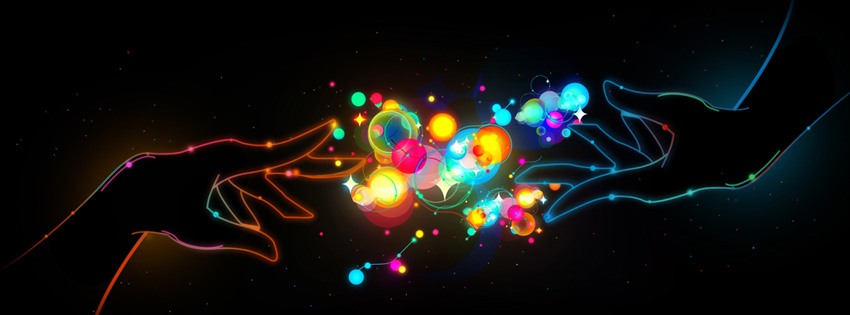

<h2 align="center">Hi there, my name is Reno 👋🏼</h2>

✍🏼 I’m currently learning to become a full stack developer at Codecool, however it's more clear now that I want to dig deeper in **frontend** development. It's really fascinating to see an app **visually unfold** and be a part of it. Recently, I've started to get to know Php and Laravel to be able to build a server for my frontend apps. During my studies, I've became familiar with a number of technologies, both backend and frontend, as well as **agile** methodologies. 

💚 Interests/Technologies: ReactJs, HTML, CSS, JS, Bootstrap, OOP, PHP, Laravel, MySQL

  
  
  
  

🔥 Fun fact: I am really passionate about dance, especially hip hop.

